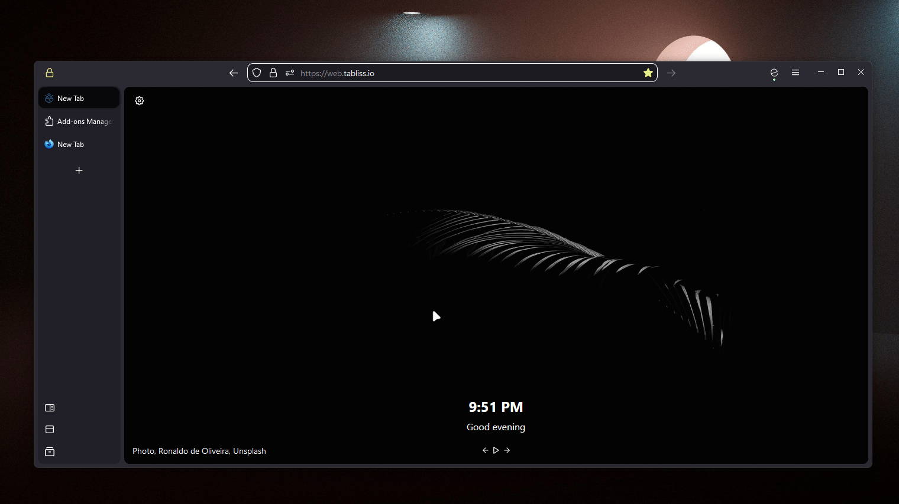

# Firefox Themes
> Collection of customizable firefox themes.


# Index
- [Setup](#setup)
</div>


# Setup
```
- Enable custom-styling in firefox
about:config
    toolkit.legacyUserProfileCustomizations.stylesheets = true
- Determine default profile (xxxx)
about:profiles
- Clone repo, copy chosen theme files to default profile's chrome folder
git clone https://github.com/CRTejaswi/ff-themes
cp ff-themes/$THEME/* $HOME/AppData/Roaming/Mozilla/Firefox/Profiles/xxxx.default-release/chrome
```

__Themes__ <br>
- [Ultima](https://github.com/soulhotel/FF-ULTIMA) <br>
 
 [](https://github.com/soulhotel/FF-ULTIMA/blob/main/Modification.md)



